

<h1>
# Fitness Landscape of Functions #
</h1>

## Ackley Function

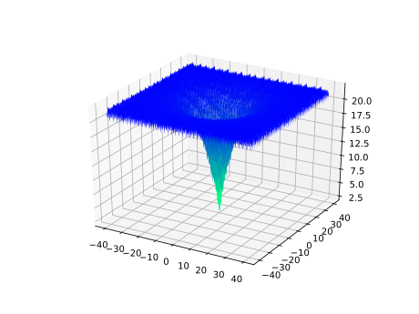

## Ackley N.2 Function

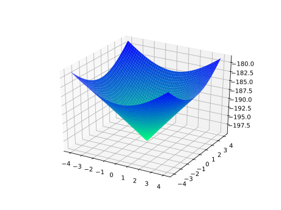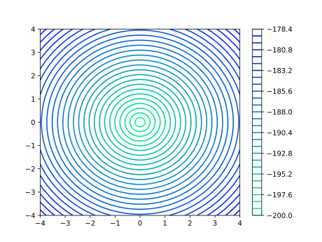

## Ackley N.3 Function

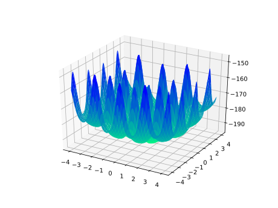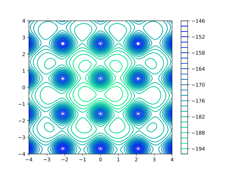

## Adjiman Function

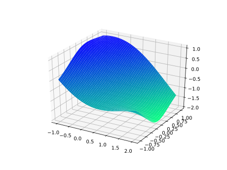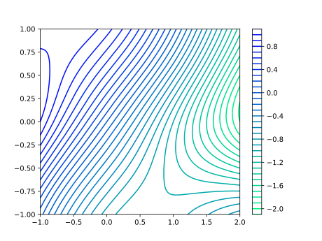

## Alpine N.1 Function

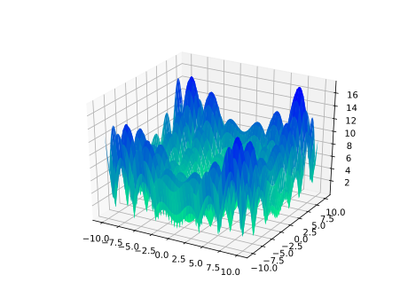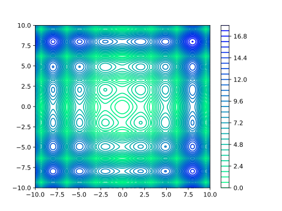

## Alpine N.2 Function

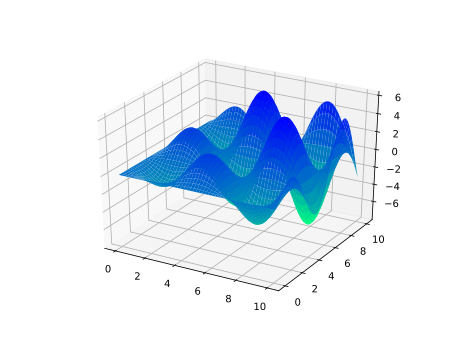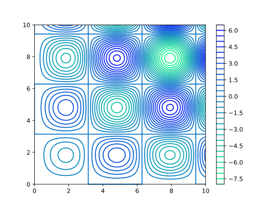

## Bartelsconn Function

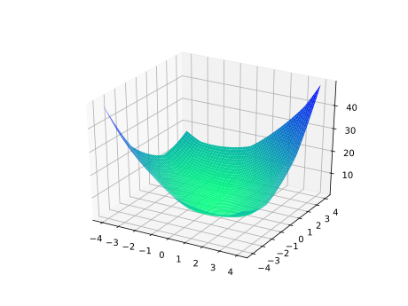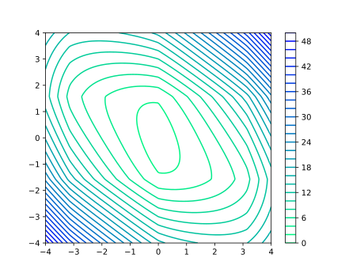

## Beale Function

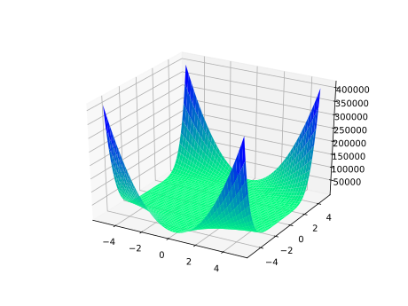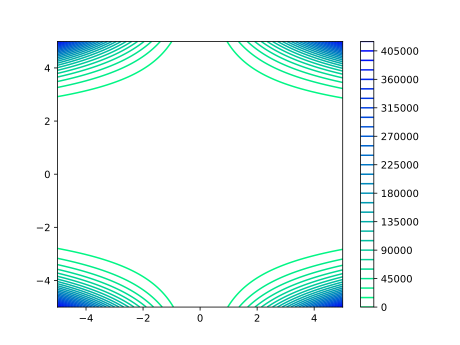

## Bird Function

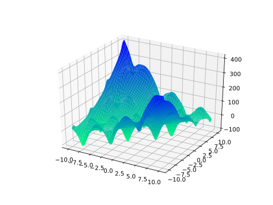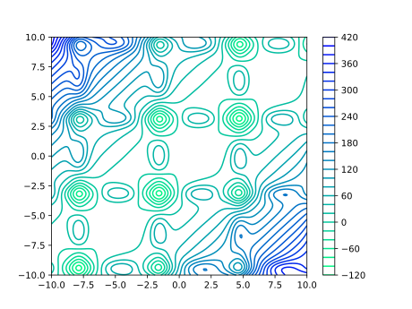

## Bohachevsky N.1 Function

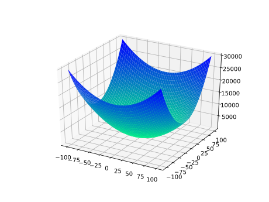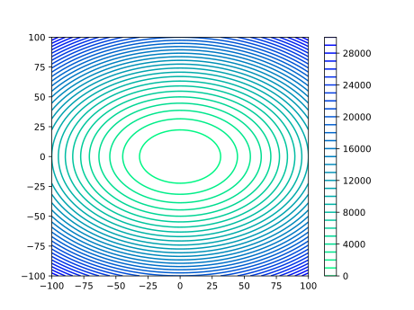

## Bohachevsky N.2 Function

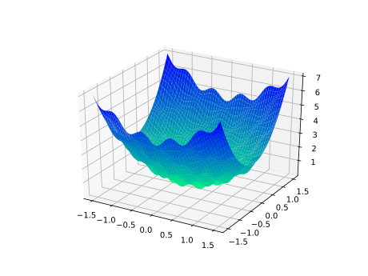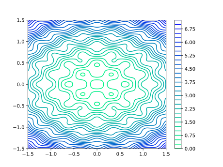

## Booth Function

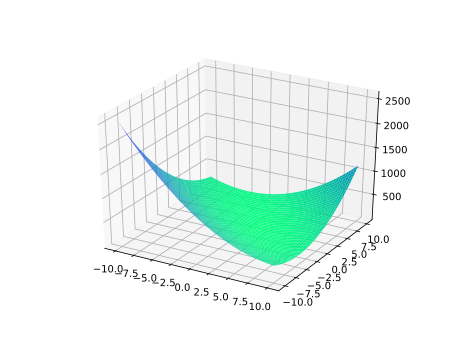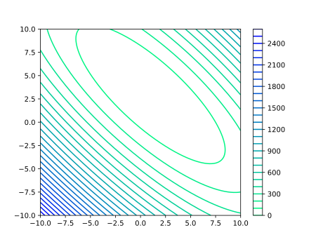

## Brent Function

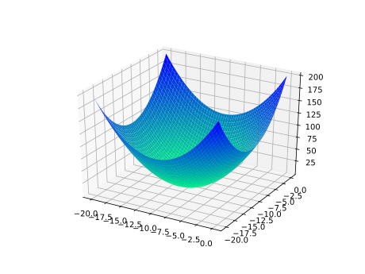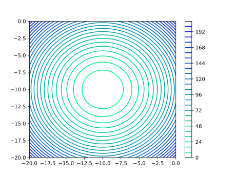

## Brown Function

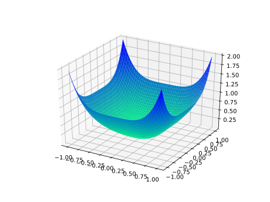

## Bukin N.6 Function

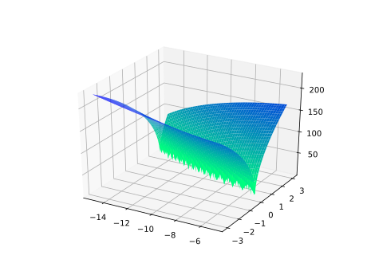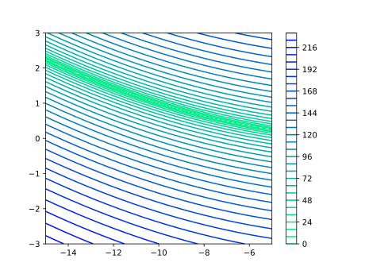

## Cross-in-Tray Function

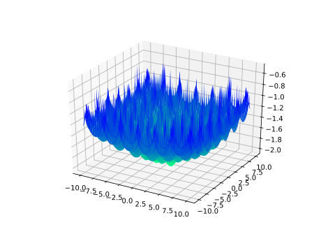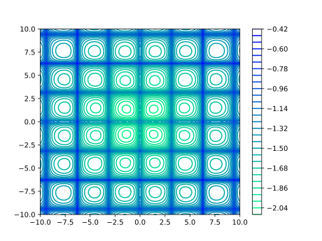

## Deckkers-Aarts Function

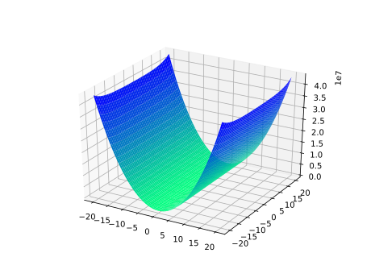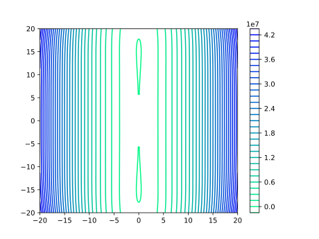

## Dropwave Function

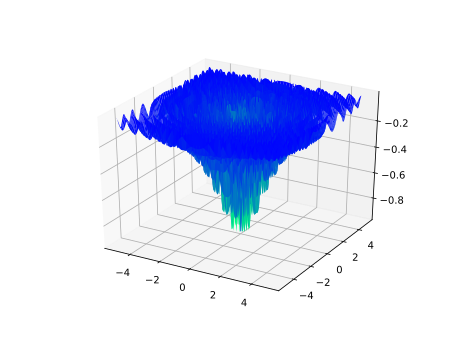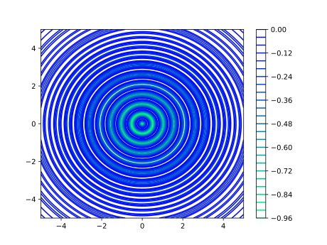

## Easom Function

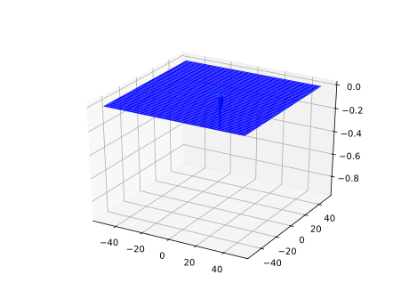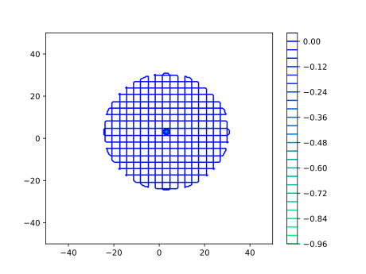

## Egg Crate Function

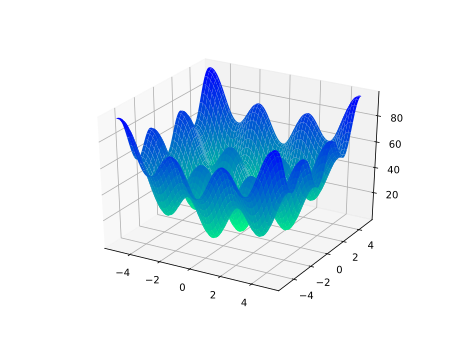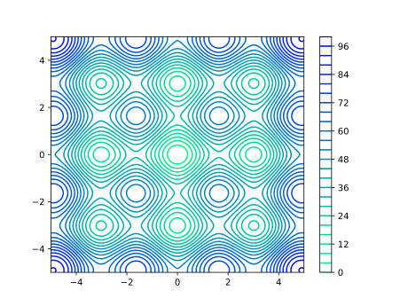

## Eggholder Function

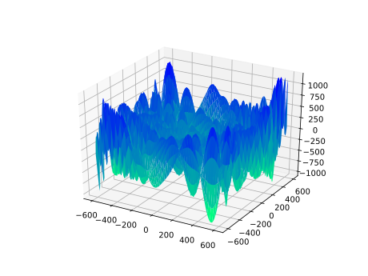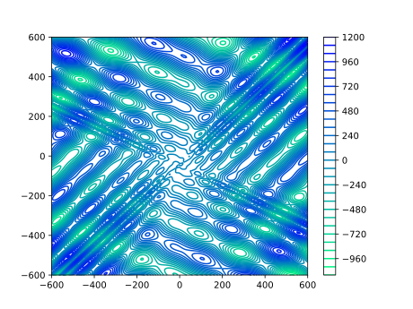

## Exponential Function

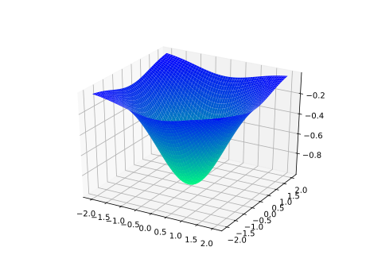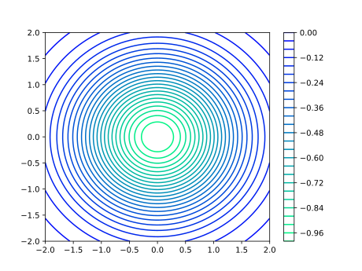

## Goldstein-Price Function

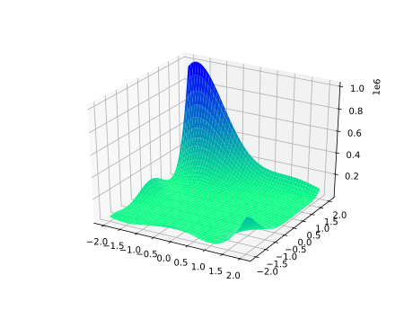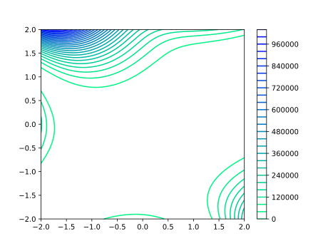

## Gramacy & Lee Function

<!-- 

 -->

## Griewank Function

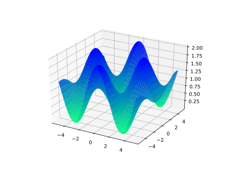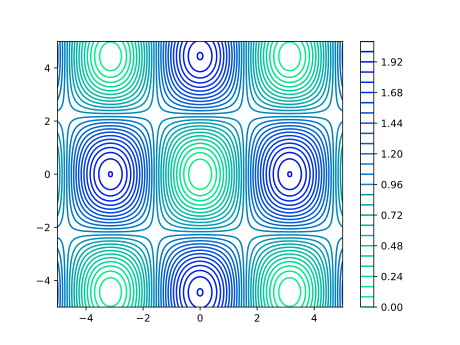

## Happy Cat Function

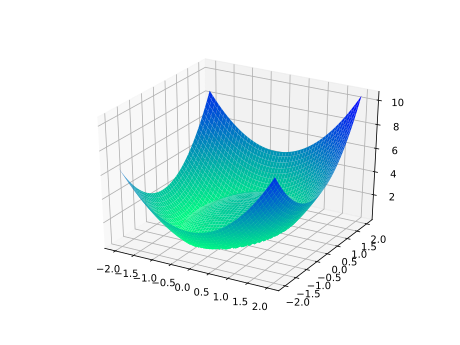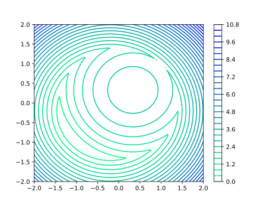

## Himmelblau Function

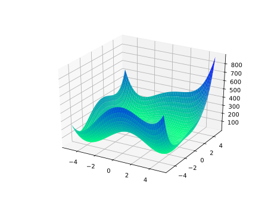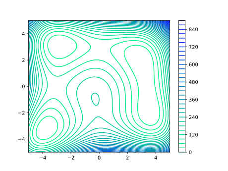

## Holder-Table Function

## Keane Function

## Leon Function

## Levi N.13 Function

## Matyas Function

## McCormick Function

## Periodic Function

## Picheny Function

## Powell Sum Function

## Qing Function

## Quartic Function

## Rastrigin Function

## Ridge Function

## Rosenbrock Function

## Salomon Function

## Schaffer N.1 Function

## Schaffer N.2 Function

## Schaffer N.3 Function

## Schaffer N.4 Function

## Schwefel 2.20 Function

## Schwefel 2.21 Function

## Schwefel 2.22 Function

## Schwefel 2.23 Function

## Schwefel Function

## Sphere Function

## Styblinski-Tang Function

## Sum Squares Function

## Three-Hump Camel Function

## Wolfe Function

<!-- 

 -->

## Xin-She Yang N.1 Function

## Xin-She Yang N.2 Function

## Xin-She Yang N.3 Function

## Xin-She Yang N.4 Function

## Zakharov Function

