# List of SOP Functions

- Ackley Function [>>](#ackley-function)
```n-dim``` | ```differentiable``` | ```non-convex``` | ```multimodal``` | ```separable```

- Ackley N.2 Function [>>](#ackley-n2-function)
```2-dim``` | ```differentiable``` | ```convex``` | ```unimodal``` | ```non-separable```

- Ackley N.3 Function [>>](#ackley-n3-function)
```2-dim``` | ```differentiable``` | ```non-convex``` | ```multimodal``` | ```non-separable```

- Adjiman Function [>>](#adjiman-function)
```2-dim``` | ```differentiable``` | ```non-convex``` | ```multimodal``` | ```non-separable```

- Alpine N.1 Function [>>](#alpine-n1-function)
```n-dim``` | ```differentiable``` | ```non-convex``` | ```multimodal``` | ```non-separable```

- Alpine N.2 Function [>>](#alpine-n2-function)
```n-dim``` | ```differentiable``` | ```non-convex``` | ```multimodal``` | ```non-separable```

- Bartelsconn Function [>>](#bartelsconn-function)
```2-dim``` | ```non-differentiable``` | ```non-convex``` | ```multimodal``` | ```non-separable```

- Beale Function [>>](#beale-function)
```2-dim``` | ```differentiable``` | ```non-convex``` | ```multimodal``` | ```non-separable```

- Bird Function [>>](#bird-function)
```2-dim``` | ```differentiable``` | ```non-convex``` | ```multimodal``` | ```non-separable```

- Bohachevsky N.1 Function [>>](#bohachevsky-n1-function)
```2-dim``` | ```differentiable``` | ```non-convex``` | ```multimodal``` | ```non-separable```

- Bohachevsky N.2 Function [>>](#bohachevsky-n2-function)
```2-dim``` | ```differentiable``` | ```non-convex``` | ```multimodal``` | ```non-separable```

- Booth Function [>>](#booth-function)
```2-dim``` | ```differentiable``` | ```convex``` | ```unimodal``` | ```non-separable```

- Brent Function [>>](#brent-function)
```2-dim``` | ```differentiable``` | ```convex``` | ```unimodal``` | ```non-separable```

- BrownFunction [>>](#brown-function)
```n-dim``` | ```differentiable``` | ```convex``` | ```unimodal``` | ```non-separable```

- Bukin N.6 Function [>>](#bukin-n6-function)
```2-dim``` | ```non-differentiable``` | ```convex``` | ```multimodal``` | ```non-separable```

- Cross-in-Tray Function [>>](#cross-in-tray-function)
```2-dim``` | ```non-differentiable``` | ```non-convex``` | ```multimodal``` | ```non-separable```

- Deckkers-Aarts Function [>>](#deckkers-aarts-function)
```2-dim``` | ```differentiable``` | ```non-convex``` | ```multimodal``` | ```non-separable```

- Dropwave Function [>>](#dropwave-function)
```2-dim``` | ```differentiable``` | ```non-convex``` | ```multimodal``` | ```non-separable```

- Easom Function [>>](#easom-function)
```2-dim``` | ```differentiable``` | ```non-convex``` | ```multimodal``` | ```separable```

- Egg Crate Function [>>](#egg-crate-function)
```2-dim``` | ```differentiable``` | ```non-convex``` | ```multimodal``` | ```separable```

- Eggholder Function [>>](#eggholder-function)
```2-dim``` | ```differentiable``` | ```non-convex``` | ```multimodal``` | ```non-separable```

- Exponential Function [>>](#exponential-function)
```n-dim``` | ```differentiable``` | ```convex``` | ```unimodal``` | ```non-separable```

- Goldstein-Price Function [>>](#goldstein-price-function)
```2-dim``` | ```differentiable``` | ```non-convex``` | ```multimodal``` | ```non-separable```

- Gramacy & Lee Function [>>](#gramacy--lee-function)
```1-dim``` | ```differentiable``` | ```non-convex``` | ```multimodal``` | ```separable```

- Griewank Function [>>](#griewank-function)
```n-dim``` | ```differentiable``` | ```non-convex``` | ```multimodal``` | ```non-separable```

- Happy Cat Function [>>](#happy-cat-function)
```n-dim``` | ```differentiable``` | ```non-convex``` | ```multimodal``` | ```non-separable```

- Himmelblau Function [>>](#himmelblau-function)
```2-dim``` | ```differentiable``` | ```non-convex``` | ```multimodal``` | ```non-separable```

- Holder-Table Function [>>](#holder-table-function)
```2-dim``` | ```non-differentiable``` | ```non-convex``` | ```multimodal``` | ```non-separable```

- Keane Function [>>](#keane-function)
```2-dim``` | ```differentiable``` | ```non-convex``` | ```multimodal``` | ```non-separable```

- Leon Function [>>](#leon-function)
```2-dim``` | ```differentiable``` | ```non-convex``` | ```multimodal``` | ```non-separable```

- Levi N.13 Function [>>](#levi-n13-function)
```2-dim``` | ```differentiable``` | ```non-convex``` | ```multimodal``` | ```non-separable```

- Matyas Function [>>](#matyas-function)
```2-dim``` | ```differentiable``` | ```convex``` | ```unimodal``` | ```non-separable```

- McCormick Function [>>](#mccormick-function)
```2-dim``` | ```differentiable``` | ```convex``` | ```multimodal``` | ```non-separable```

- Periodic Function [>>](#periodic-function)
```n-dim``` | ```differentiable``` | ```non-convex``` | ```multimodal``` | ```non-separable```

- Picheny Function [>>](#picheny-function)
```2-dim``` | ```differentiable``` | ```non-convex``` | ```multimodal``` | ```non-separable```

- Powell Sum Function [>>](#powell-sum-function)
```n-dim``` | ```differentiable``` | ```convex``` | ```unimodal``` | ```separable```

- Qing Function [>>](#qing-function)
```n-dim``` | ```differentiable``` | ```non-convex``` | ```multimodal``` | ```non-separable```

- Quatric Function [>>](#quartic-function)
```n-dim``` | ```differentiable``` | ```non-convex``` | ```multimodal``` | ```separable``` | ```random```

- RastriginFunction [>>](#rastrigin-function)
```n-dim``` | ```differentiable``` | ```non-convex``` | ```multimodal``` | ```separable```

- Ridge Function [>>](#ridge-function)
```n-dim``` | ```differentiable``` | ```non-convex``` | ```multimodal``` | ```non-separable```

- Rosenbrock Function [>>](#rosenbrock-function)
```n-dim``` | ```differentiable``` | ```convex``` | ```unimodal``` | ```non-separable```

- Salomon Function [>>](#salomon-function)
```n-dim``` | ```differentiable``` | ```non-convex``` | ```multimodal``` | ```non-separable```

- Schaffer N.1 Function [>>](#schaffer-n1-function)
```2-dim``` | ```differentiable``` | ```non-convex``` | ```multimodal``` | ```non-separable```

- Schaffer N.2 Function [>>](#schaffer-n2-function)
```2-dim``` | ```differentiable``` | ```non-convex``` | ```multimodal``` | ```non-separable```

- Schaffer N.3 Function [>>](#schaffer-n3-function)
```2-dim``` | ```differentiable``` | ```non-convex``` | ```multimodal``` | ```non-separable```

- Schaffer N.4 Function [>>](#schaffer-n4-function)
```2-dim``` | ```differentiable``` | ```non-convex``` | ```multimodal``` | ```non-separable```

- Schwefel 2.20 Function [>>](#schwefel-220-function)
```n-dim``` | ```non-differentiable``` | ```convex``` | ```unimodal``` | ```separable```

- Schwefel 2.21 Function [>>](#schwefel-221-function)
```n-dim``` | ```non-differentiable``` | ```convex``` | ```unimodal``` | ```separable```

- Schwefel 2.22 Function [>>](#schwefel-222-function)
```n-dim``` | ```non-differentiable``` | ```convex``` | ```unimodal``` | ```non-separable```

- Schwefel 2.23 Function [>>](#schwefel-223-function)
```n-dim``` | ```differentiable``` | ```convex``` | ```unimodal``` | ```separable```

- Schwefel Function [>>](#schwefel-function)
```n-dim``` | ```differentiable``` | ```non-convex``` | ```multimodal``` | ```separable```

- Sphere Function [>>](#sphere-function)
```n-dim``` | ```differentiable``` | ```convex``` | ```unimodal``` | ```separable```

- Styblinski-Tang Function [>>](#styblinski-tang-function)
```n-dim``` | ```differentiable``` | ```non-convex``` | ```multimodal``` | ```separable```

- Sum Squares Function [>>](#sum-squares-function)
```n-dim``` | ```differentiable``` | ```convex``` | ```unimodal``` | ```separable```

- Three-Hump Camel Function [>>](#three-hump-camel-function)
```2-dim``` | ```differentiable``` | ```non-convex``` | ```multimodal``` | ```non-separable```

- Wolfe Function [>>](#wolfe-function)
```3-dim``` | ```non-differentiable``` | ```non-convex``` | ```multimodal``` | ```separable```

- Xin-She Yang N.1 Function [>>](#xin-she-yang-n1-function)
```n-dim``` | ```non-differentiable``` | ```non-convex``` | ```multimodal``` | ```separable``` | ```random```

- Xin-She Yang N.2 Function [>>](#xin-she-yang-n2-function)
```n-dim``` | ```non-differentiable``` | ```non-convex``` | ```multimodal``` | ```non-separable```

- Xin-She Yang N.3 Function [>>](#xin-she-yang-n3-function)
```n-dim``` | ```differentiable``` | ```non-convex``` | ```multimodal``` | ```non-separable```

- Xin-She Yang N.4 Function [>>](#xin-she-yang-n4-function)
```n-dim``` | ```non-differentiable``` | ```non-convex``` | ```multimodal``` | ```non-separable```

- Zakharov Function [>>](#zakharov-function)
```n-dim``` | ```differentiable``` | ```convex``` | ```unimodal``` | ```non-separable```

## Ackley Function

 

## Ackley N.2 Function

 

## Ackley N.3 Function

 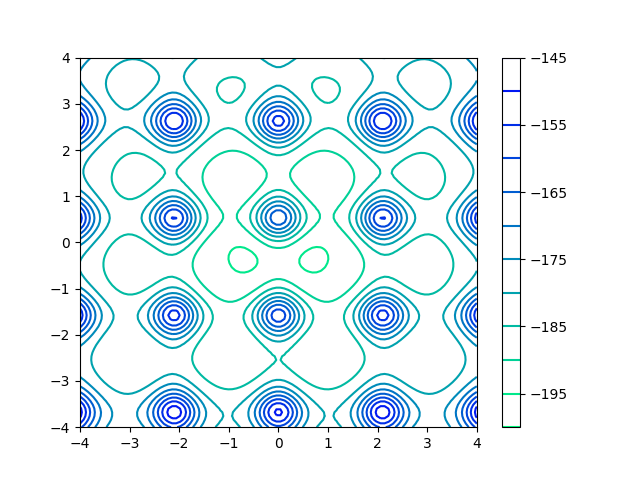

## Adjiman Function

 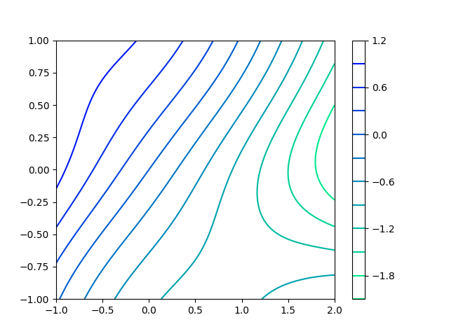

## Alpine N.1 Function

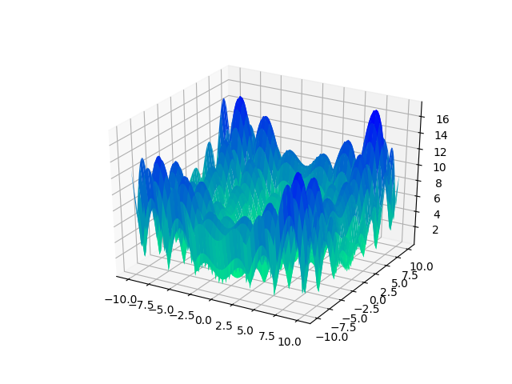 

## Alpine N.2 Function

 

## Bartelsconn Function

 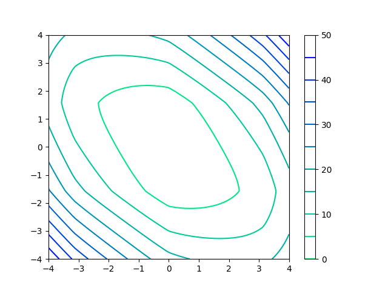

## Beale Function

 

## Bird Function

 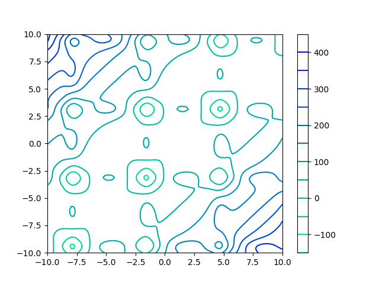

## Bohachevsky N.1 Function

 

## Bohachevsky N.2 Function

 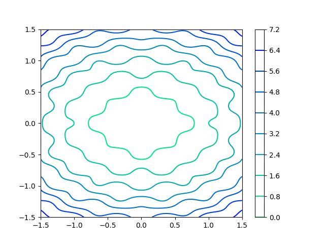

## Booth Function

 

## Brent Function

 

## Brown Function

 

## Bukin N.6 Function

 

## Cross-in-Tray Function

 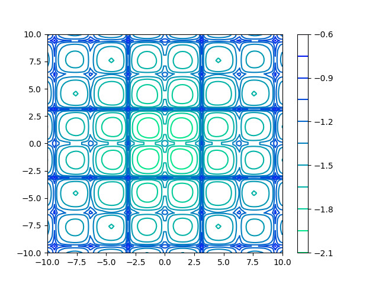

## Deckkers-Aarts Function

 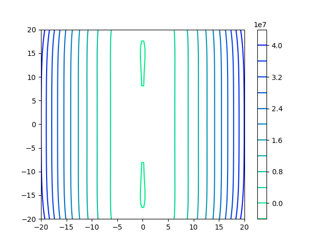

## Dropwave Function

 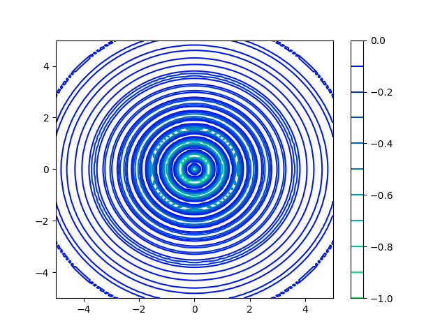

## Easom Function

 

## Egg Crate Function

 

## Eggholder Function

 

## Exponential Function

 

## Goldstein-Price Function

 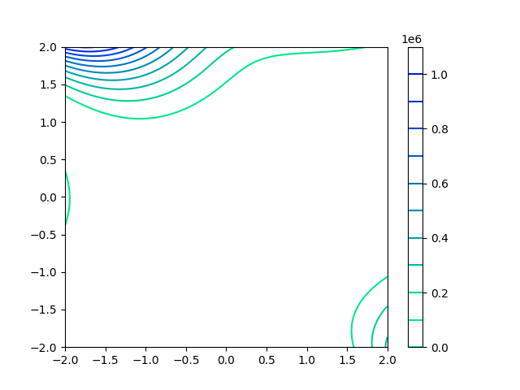

## Gramacy & Lee Function

**This function does not support 2D domain.**

<!--   -->

## Griewank Function

 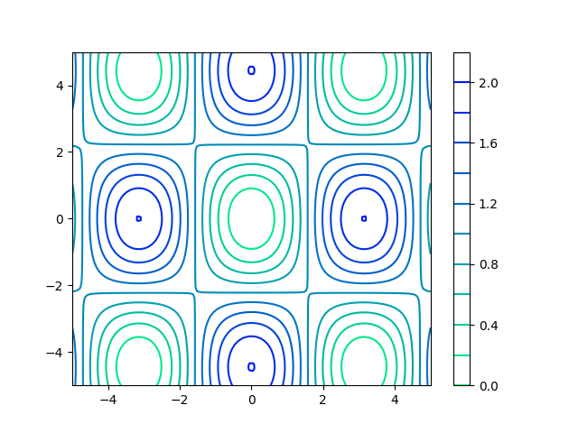

## Happy Cat Function

 

## Himmelblau Function

 

## Holder-Table Function

 

## Keane Function

 

## Leon Function

 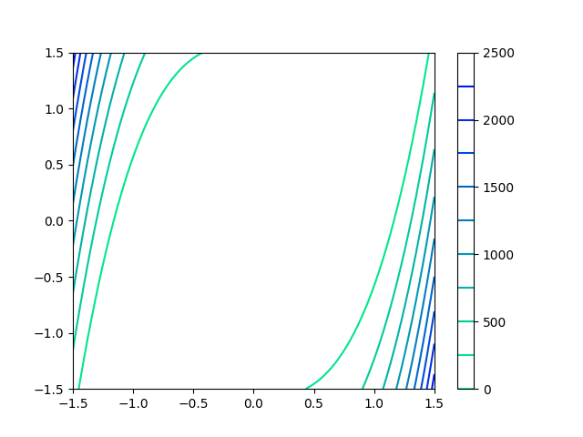

## Levi N.13 Function

 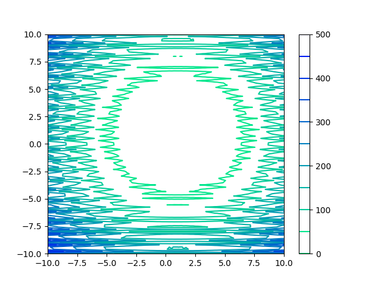

## Matyas Function

 

## McCormick Function

 

## Periodic Function

 

## Picheny Function


 

## Powell Sum Function

 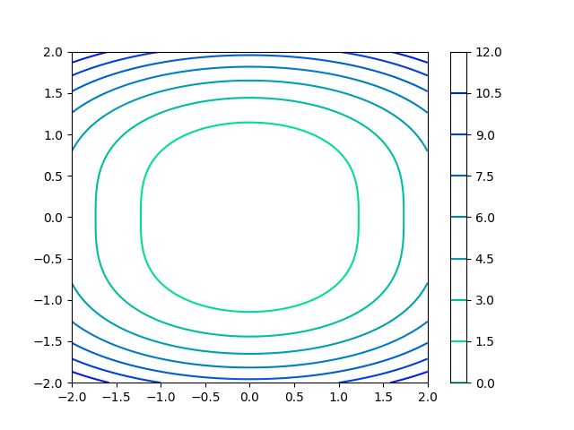

## Qing Function

 

## Quartic Function

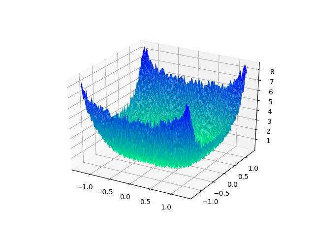 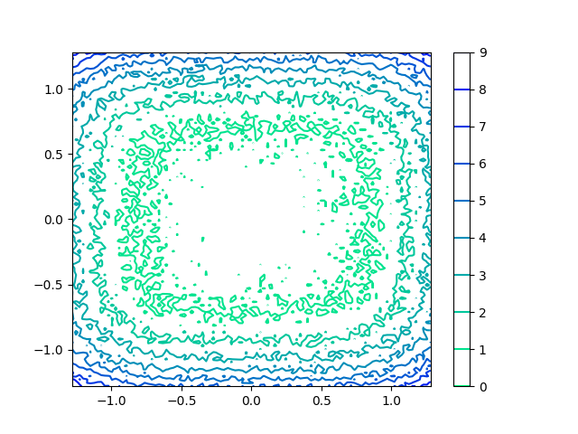

## Rastrigin Function

 

## Ridge Function

 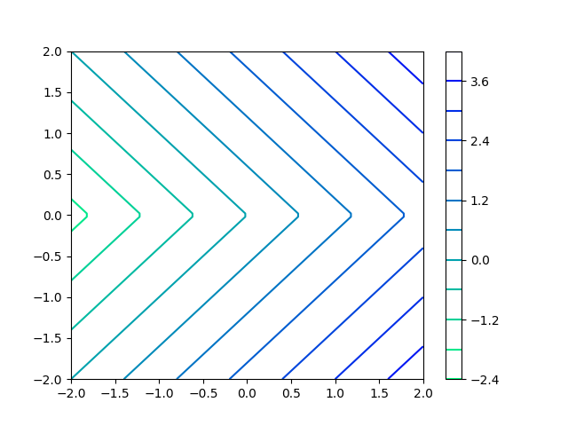

## Rosenbrock Function

 

## Salomon Function

 

## Schaffer N.1 Function

 

## Schaffer N.2 Function

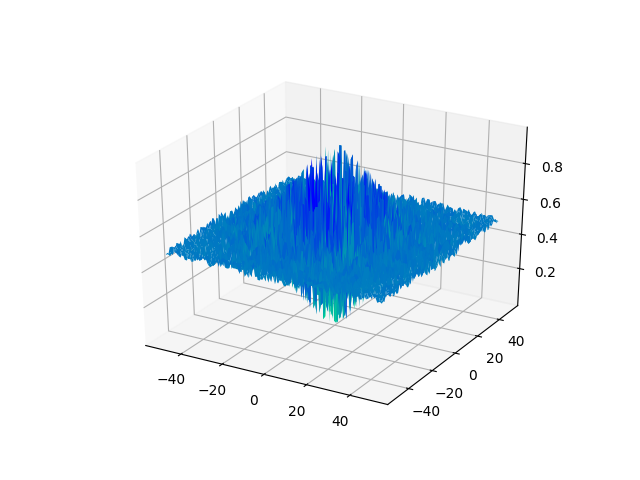 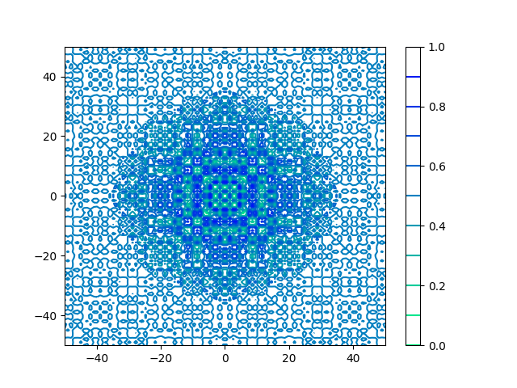

## Schaffer N.3 Function

 

## Schaffer N.4 Function

 

## Schwefel 2.20 Function

 

## Schwefel 2.21 Function

 

## Schwefel 2.22 Function

 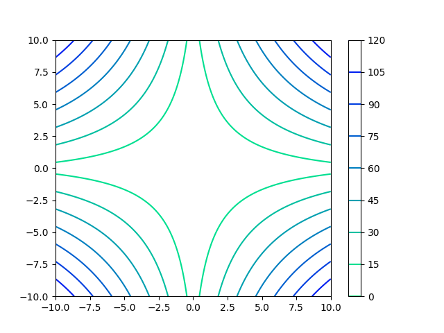

## Schwefel 2.23 Function

 

## Schwefel Function

 

## Sphere Function

 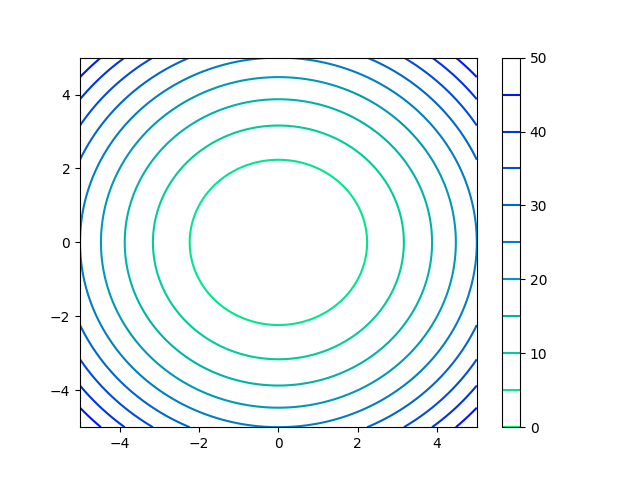

## Styblinski-Tang Function

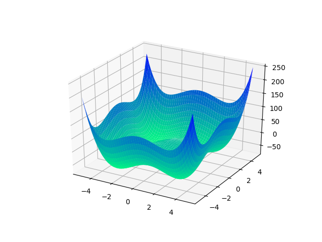 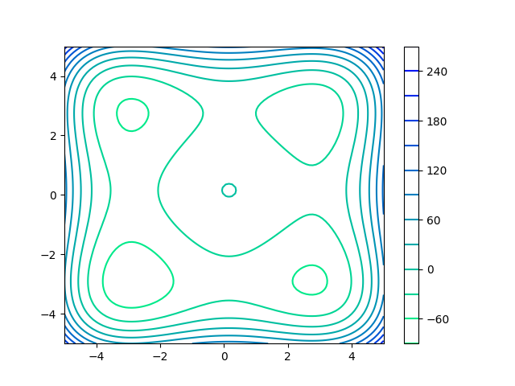

## Sum Squares Function

 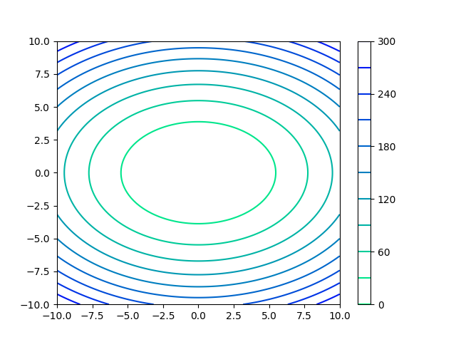

## Three-Hump Camel Function

 

## Wolfe Function

**This function does not support 2D domain.**

<!--   -->

## Xin-She Yang N.1 Function

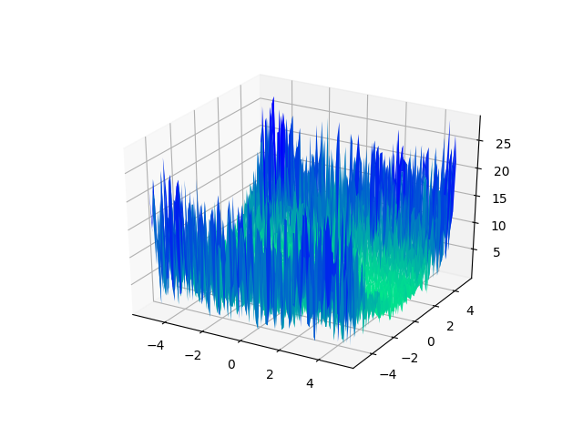 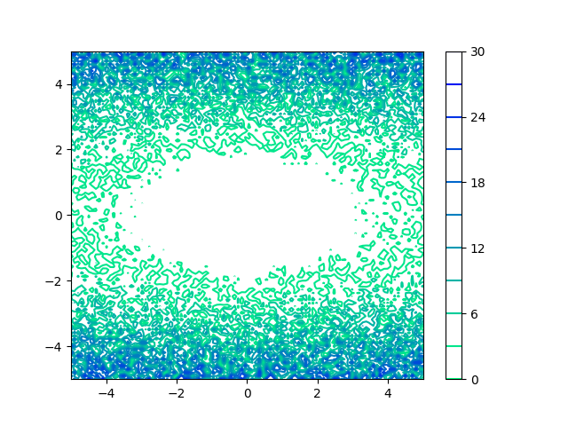

## Xin-She Yang N.2 Function

 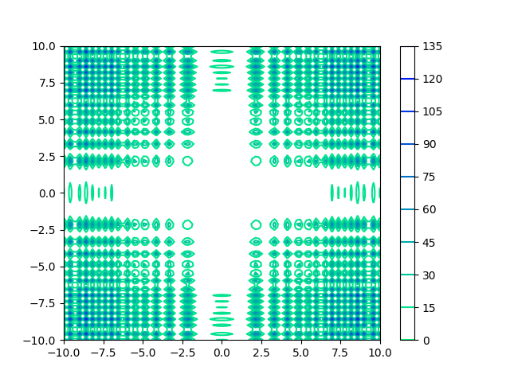

## Xin-She Yang N.3 Function

 

## Xin-She Yang N.4 Function

 

## Zakharov Function

 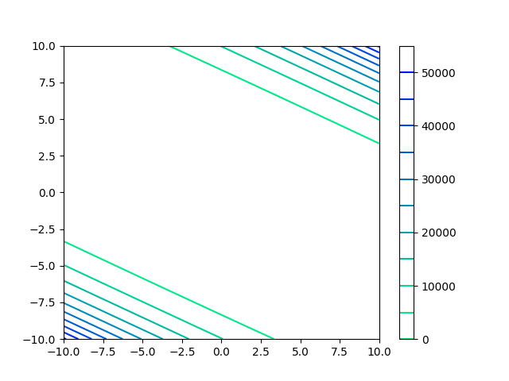