<h1>
<p align="center"># List of SOP Functions #</p>
<p align="center">Fitness landscape of single-objective optimization functions</p>
</h1>

- Ackley Function [>>](#ackley-function)
```n-dim``` ```differentiable``` ```non-convex``` ```multimodal``` ```separable```

- Ackley N.2 Function [>>](#ackley-n2-function)
```2-dim``` ```differentiable``` ```convex``` ```unimodal``` ```non-separable```

- Ackley N.3 Function [>>](#ackley-n3-function)
```2-dim``` ```differentiable``` ```non-convex``` ```multimodal``` ```non-separable```

- Adjiman Function [>>](#adjiman-function)
```2-dim``` ```differentiable``` ```non-convex``` ```multimodal``` ```non-separable```

- Alpine N.1 Function [>>](#alpine-n1-function)
```n-dim``` ```differentiable``` ```non-convex``` ```multimodal``` ```non-separable```

- Alpine N.2 Function [>>](#alpine-n2-function)
```n-dim``` ```differentiable``` ```non-convex``` ```multimodal``` ```non-separable```

- Bartelsconn Function [>>](#bartelsconn-function)
```2-dim``` ```non-differentiable``` ```non-convex``` ```multimodal``` ```non-separable```

- Beale Function [>>](#beale-function)
```2-dim``` ```differentiable``` ```non-convex``` ```multimodal``` ```non-separable```

- Bird Function [>>](#bird-function)
```2-dim``` ```differentiable``` ```non-convex``` ```multimodal``` ```non-separable```

- Bohachevsky N.1 Function [>>](#bohachevsky-n1-function)
```2-dim``` ```differentiable``` ```non-convex``` ```multimodal``` ```non-separable```

- Bohachevsky N.2 Function [>>](#bohachevsky-n2-function)
```2-dim``` ```differentiable``` ```non-convex``` ```multimodal``` ```non-separable```

- Booth Function [>>](#booth-function)
```2-dim``` ```differentiable``` ```convex``` ```unimodal``` ```non-separable```

- Brent Function [>>](#brent-function)
```2-dim``` ```differentiable``` ```convex``` ```unimodal``` ```non-separable```

- BrownFunction [>>](#brown-function)
```n-dim``` ```differentiable``` ```convex``` ```unimodal``` ```non-separable```

- Bukin N.6 Function [>>](#bukin-n6-function)
```2-dim``` ```non-differentiable``` ```convex``` ```multimodal``` ```non-separable```

- Cross-in-Tray Function [>>](#cross-in-tray-function)
```2-dim``` ```non-differentiable``` ```non-convex``` ```multimodal``` ```non-separable```

- Deckkers-Aarts Function [>>](#deckkers-aarts-function)
```2-dim``` ```differentiable``` ```non-convex``` ```multimodal``` ```non-separable```

- Dropwave Function [>>](#dropwave-function)
```2-dim``` ```differentiable``` ```non-convex``` ```multimodal``` ```non-separable```

- Easom Function [>>](#easom-function)
```2-dim``` ```differentiable``` ```non-convex``` ```multimodal``` ```separable```

- Egg Crate Function [>>](#egg-crate-function)
```2-dim``` ```differentiable``` ```non-convex``` ```multimodal``` ```separable```

- Eggholder Function [>>](#eggholder-function)
```2-dim``` ```differentiable``` ```non-convex``` ```multimodal``` ```non-separable```

- Exponential Function [>>](#exponential-function)
```n-dim``` ```differentiable``` ```convex``` ```unimodal``` ```non-separable```

- Goldstein-Price Function [>>](#goldstein-price-function)
```2-dim``` ```differentiable``` ```non-convex``` ```multimodal``` ```non-separable```

- Gramacy & Lee Function [>>](#gramacy--lee-function)
```1-dim``` ```differentiable``` ```non-convex``` ```multimodal``` ```separable```

- Griewank Function [>>](#griewank-function)
```n-dim``` ```differentiable``` ```non-convex``` ```multimodal``` ```non-separable```

- Happy Cat Function [>>](#happy-cat-function)
```n-dim``` ```differentiable``` ```non-convex``` ```multimodal``` ```non-separable```

- Himmelblau Function [>>](#himmelblau-function)
```2-dim``` ```differentiable``` ```non-convex``` ```multimodal``` ```non-separable```

- Holder-Table Function [>>](#holder-table-function)
```2-dim``` ```non-differentiable``` ```non-convex``` ```multimodal``` ```non-separable```

- Keane Function [>>](#keane-function)
```2-dim``` ```differentiable``` ```non-convex``` ```multimodal``` ```non-separable```

- Leon Function [>>](#leon-function)
```2-dim``` ```differentiable``` ```non-convex``` ```multimodal``` ```non-separable```

- Levi N.13 Function [>>](#levi-n13-function)
```2-dim``` ```differentiable``` ```non-convex``` ```multimodal``` ```non-separable```

- Matyas Function [>>](#matyas-function)
```2-dim``` ```differentiable``` ```convex``` ```unimodal``` ```non-separable```

- McCormick Function [>>](#mccormick-function)
```2-dim``` ```differentiable``` ```convex``` ```multimodal``` ```non-separable```

- Periodic Function [>>](#periodic-function)
```n-dim``` ```differentiable``` ```non-convex``` ```multimodal``` ```non-separable```

- Picheny Function [>>](#picheny-function)
```2-dim``` ```differentiable``` ```non-convex``` ```multimodal``` ```non-separable```

- Powell Sum Function [>>](#powell-sum-function)
```n-dim``` ```differentiable``` ```convex``` ```unimodal``` ```separable```

- Qing Function [>>](#qing-function)
```n-dim``` ```differentiable``` ```non-convex``` ```multimodal``` ```non-separable```

- Quatric Function [>>](#quartic-function)
```n-dim``` ```differentiable``` ```non-convex``` ```multimodal``` ```separable``` ```random```

- RastriginFunction [>>](#rastrigin-function)
```n-dim``` ```differentiable``` ```non-convex``` ```multimodal``` ```separable```

- Ridge Function [>>](#ridge-function)
```n-dim``` ```differentiable``` ```non-convex``` ```multimodal``` ```non-separable```

- Rosenbrock Function [>>](#rosenbrock-function)
```n-dim``` ```differentiable``` ```convex``` ```unimodal``` ```non-separable```

- Salomon Function [>>](#salomon-function)
```n-dim``` ```differentiable``` ```non-convex``` ```multimodal``` ```non-separable```

- Schaffer N.1 Function [>>](#schaffer-n1-function)
```2-dim``` ```differentiable``` ```non-convex``` ```multimodal``` ```non-separable```

- Schaffer N.2 Function [>>](#schaffer-n2-function)
```2-dim``` ```differentiable``` ```non-convex``` ```multimodal``` ```non-separable```

- Schaffer N.3 Function [>>](#schaffer-n3-function)
```2-dim``` ```differentiable``` ```non-convex``` ```multimodal``` ```non-separable```

- Schaffer N.4 Function [>>](#schaffer-n4-function)
```2-dim``` ```differentiable``` ```non-convex``` ```multimodal``` ```non-separable```

- Schwefel 2.20 Function [>>](#schwefel-220-function)
```n-dim``` ```non-differentiable``` ```convex``` ```unimodal``` ```separable```

- Schwefel 2.21 Function [>>](#schwefel-221-function)
```n-dim``` ```non-differentiable``` ```convex``` ```unimodal``` ```separable```

- Schwefel 2.22 Function [>>](#schwefel-222-function)
```n-dim``` ```non-differentiable``` ```convex``` ```unimodal``` ```non-separable```

- Schwefel 2.23 Function [>>](#schwefel-223-function)
```n-dim``` ```differentiable``` ```convex``` ```unimodal``` ```separable```

- Schwefel Function [>>](#schwefel-function)
```n-dim``` ```differentiable``` ```non-convex``` ```multimodal``` ```separable```

- Sphere Function [>>](#sphere-function)
```n-dim``` ```differentiable``` ```convex``` ```unimodal``` ```separable```

- Styblinski-Tang Function [>>](#styblinski-tang-function)
```n-dim``` ```differentiable``` ```non-convex``` ```multimodal``` ```separable```

- Sum Squares Function [>>](#sum-squares-function)
```n-dim``` ```differentiable``` ```convex``` ```unimodal``` ```separable```

- Three-Hump Camel Function [>>](#three-hump-camel-function)
```2-dim``` ```differentiable``` ```non-convex``` ```multimodal``` ```non-separable```

- Wolfe Function [>>](#wolfe-function)
```3-dim``` ```non-differentiable``` ```non-convex``` ```multimodal``` ```separable```

- Xin-She Yang N.1 Function [>>](#xin-she-yang-n1-function)
```n-dim``` ```non-differentiable``` ```non-convex``` ```multimodal``` ```separable``` ```random```

- Xin-She Yang N.2 Function [>>](#xin-she-yang-n2-function)
```n-dim``` ```non-differentiable``` ```non-convex``` ```multimodal``` ```non-separable```

- Xin-She Yang N.3 Function [>>](#xin-she-yang-n3-function)
```n-dim``` ```differentiable``` ```non-convex``` ```multimodal``` ```non-separable```

- Xin-She Yang N.4 Function [>>](#xin-she-yang-n4-function)
```n-dim``` ```non-differentiable``` ```non-convex``` ```multimodal``` ```non-separable```

- Zakharov Function [>>](#zakharov-function)
```n-dim``` ```differentiable``` ```convex``` ```unimodal``` ```non-separable```

## Ackley Function

<p float="left" align="center"></p>

## Ackley N.2 Function

<p float="left" align="center">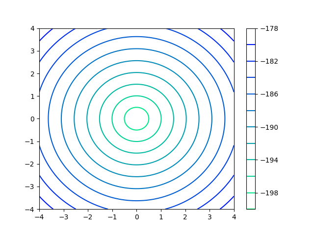</p>

## Ackley N.3 Function

<p float="left" align="center"></p>

## Adjiman Function

<p float="left" align="center"></p>

## Alpine N.1 Function

<p float="left" align="center"></p>

## Alpine N.2 Function

<p float="left" align="center">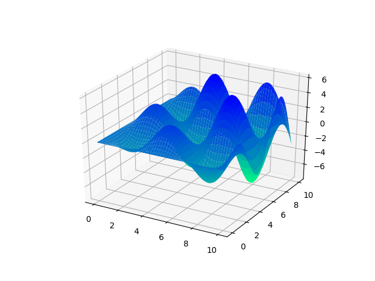</p>

## Bartelsconn Function

<p float="left" align="center"></p>

## Beale Function

<p float="left" align="center"></p>

## Bird Function

<p float="left" align="center"></p>

## Bohachevsky N.1 Function

<p float="left" align="center"></p>

## Bohachevsky N.2 Function

<p float="left" align="center"></p>

## Booth Function

<p float="left" align="center"></p>

## Brent Function

<p float="left" align="center">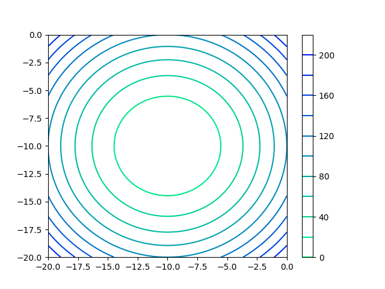</p>

## Brown Function

<p float="left" align="center"></p>

## Bukin N.6 Function

<p float="left" align="center"></p>

## Cross-in-Tray Function

<p float="left" align="center">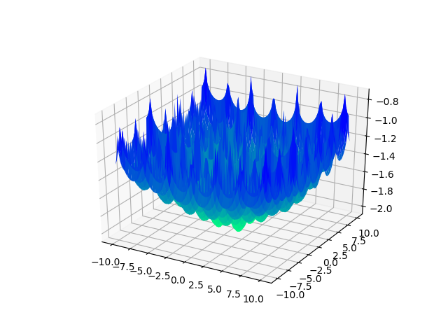</p>

## Deckkers-Aarts Function

<p float="left" align="center"></p>

## Dropwave Function

<p float="left" align="center"></p>

## Easom Function

<p float="left" align="center"></p>

## Egg Crate Function

<p float="left" align="center"></p>

## Eggholder Function

<p float="left" align="center"></p>

## Exponential Function

<p float="left" align="center"></p>

## Goldstein-Price Function

<p float="left" align="center"></p>

## Gramacy & Lee Function

**This function does not support 2D domain.**

<!-- <p float="left" align="center"></p> -->

## Griewank Function

<p float="left" align="center"></p>

## Happy Cat Function

<p float="left" align="center">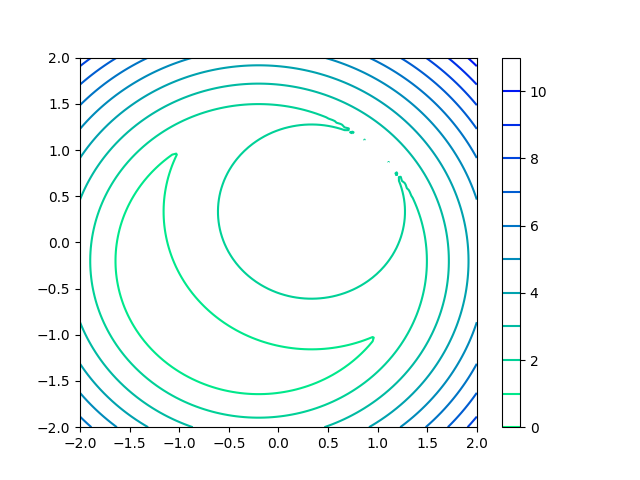</p>

## Himmelblau Function

<p float="left" align="center"></p>

## Holder-Table Function

<p float="left" align="center"></p>

## Keane Function

<p float="left" align="center">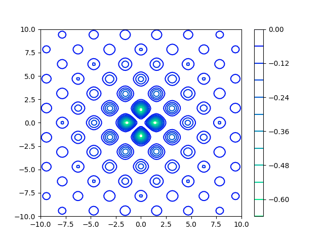</p>

## Leon Function

<p float="left" align="center"></p>

## Levi N.13 Function

<p float="left" align="center"></p>

## Matyas Function

<p float="left" align="center"></p>

## McCormick Function

<p float="left" align="center">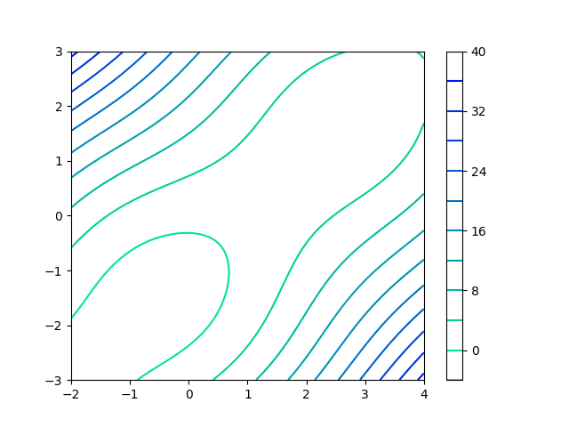</p>

## Periodic Function

<p float="left" align="center"></p>

## Picheny Function


<p float="left" align="center">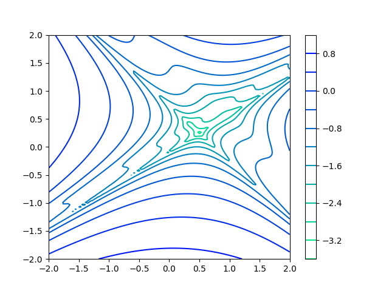</p>

## Powell Sum Function

<p float="left" align="center"></p>

## Qing Function

<p float="left" align="center">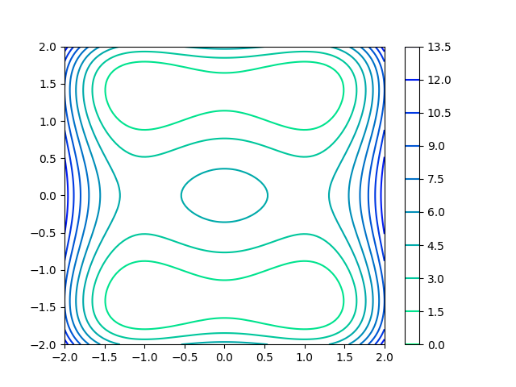</p>

## Quartic Function

<p float="left" align="center"></p>

## Rastrigin Function

<p float="left" align="center"></p>

## Ridge Function

<p float="left" align="center"></p>

## Rosenbrock Function

<p float="left" align="center"></p>

## Salomon Function

<p float="left" align="center"></p>

## Schaffer N.1 Function

<p float="left" align="center"></p>

## Schaffer N.2 Function

<p float="left" align="center"></p>

## Schaffer N.3 Function

<p float="left" align="center"></p>

## Schaffer N.4 Function

<p float="left" align="center">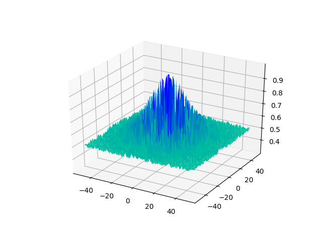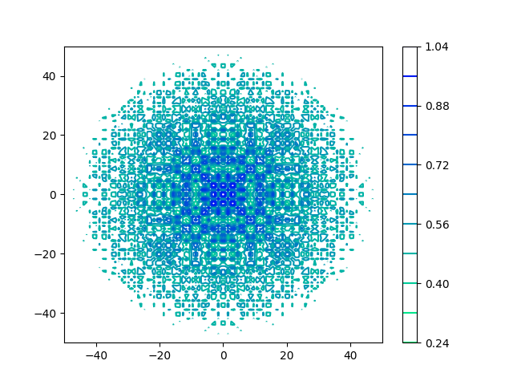</p>

## Schwefel 2.20 Function

<p float="left" align="center"></p>

## Schwefel 2.21 Function

<p float="left" align="center"></p>

## Schwefel 2.22 Function

<p float="left" align="center"></p>

## Schwefel 2.23 Function

<p float="left" align="center"></p>

## Schwefel Function

<p float="left" align="center">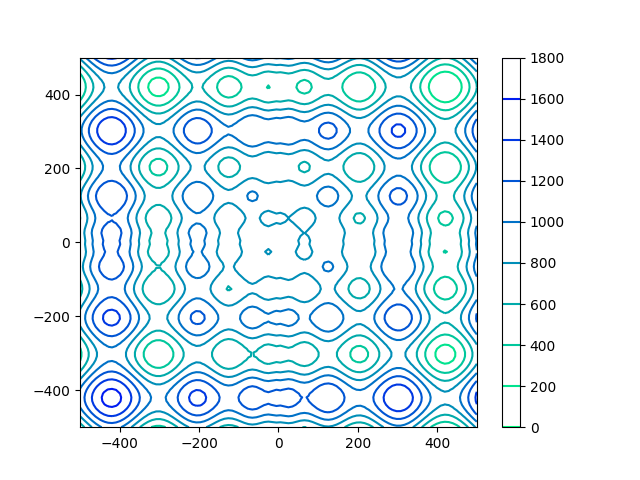</p>

## Sphere Function

<p float="left" align="center"></p>

## Styblinski-Tang Function

<p float="left" align="center"></p>

## Sum Squares Function

<p float="left" align="center"></p>

## Three-Hump Camel Function

<p float="left" align="center"></p>

## Wolfe Function

**This function does not support 2D domain.**

<!-- <p float="left" align="center"></p> -->

## Xin-She Yang N.1 Function

<p float="left" align="center"></p>

## Xin-She Yang N.2 Function

<p float="left" align="center"></p>

## Xin-She Yang N.3 Function

<p float="left" align="center"></p>

## Xin-She Yang N.4 Function

<p float="left" align="center">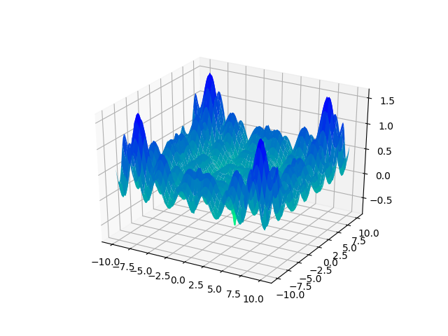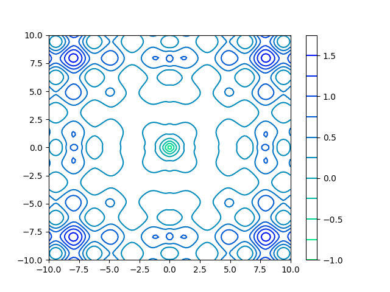</p>

## Zakharov Function

<p float="left" align="center"></p>